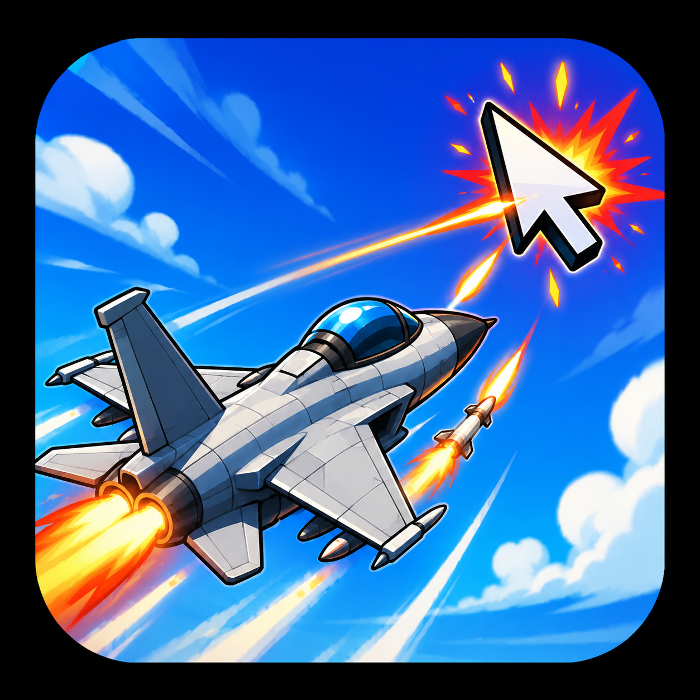

# 🛩️ Jet Follower

[](https://www.python.org/downloads/)
[](https://opensource.org/licenses/MIT)

A high-performance, `tkinter`-based fighter jet cursor follower. This isn't just a simple tracker—it's a physics-driven simulation featuring advanced maneuvers, a dual-weapon combat system, and immersive visual effects.

<p align="center">
  
</p>

## 🚀 Key Features

### 🛠️ Advanced Physics Engine
- **Velocity LERPing:** Realistic acceleration and deceleration for a "heavy" flight feel.
- **Angular Momentum:** Smooth, curved turning paths rather than instant snapping.
- **Afterburners:** Automatically engages during long-distance travel, boosting speed and switching to blue high-intensity flames.

### ⚔️ Dual-Weapon Combat System
The jet proactively defends your cursor territory:
- **Tracer Bursts:** Fires rapid-fire 25-bullet bursts with high-speed motion-blur trails.
- **Homing Missiles:** Deploys dual missiles that utilize real-time pathfinding to track and intercept targets.
- **Impact Effects:** Features micro-explosions for bullets and multi-point heavy explosions for missile impacts.

### 🎭 Visual Fidelity
- **World-Space Particles:** Smoke trails are calculated in global coordinates, allowing them to linger and drift realistically as the jet moves.
- **Barrel Rolls:** Dynamically simulates 3D rolls during high-G turns by oscillating polygon perspectives.
- **Persistent Rendering:** Optimized item pool management ensures smooth 60 FPS performance without CPU spikes.

### 🖥️ Multi-Monitor Support
- Detects the entire virtual desktop area.
- Seamlessly traverses screen boundaries and can spawn from any edge of your multi-monitor setup.

## 🕹️ Controls
- **Cursor Tracking:** The jet follows your mouse automatically with a configurable physics delay.
- **ESC / Middle Click:** Instantly close the application.
- **Auto-Respawn:** If the jet "catches" the cursor and explodes, it will automatically respawn from a random screen edge.

## 📥 Installation

1. **Prerequisites:** Python 3.x installed on your system.
2. **Setup:**
   ```bash
   # Clone the repository
   git clone https://github.com/not-GIANT/Jet-Follower.git
   cd "Jet Follower"
   
   # Run the script
   python jet_follower.py
   ```
3. **Windows Binary:** Alternatively, you can run the pre-compiled `Jet Follower.exe` directly.

## ⚙️ Configuration
You can customize almost every aspect of the simulation by editing the `CONFIG` dictionary at the top of `jet_follower.py`:

| Parameter | Description |
| :--- | :--- |
| `cursor_delay` | Input latency for the jet's reaction. |
| `max_speed` | Top speed of the jet in flight. |
| `shoot_dist` | Range at which the jet begins engaging the cursor. |
| `missile_turn_spd`| How aggressively missiles track the target. |
| `explosion_chance`| Probability of the jet exploding upon "catching" the cursor. |

---
*Developed with ❤️ by GIANT*
